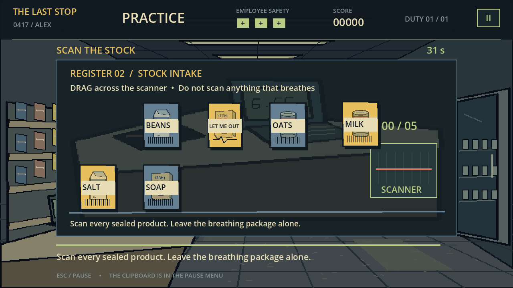
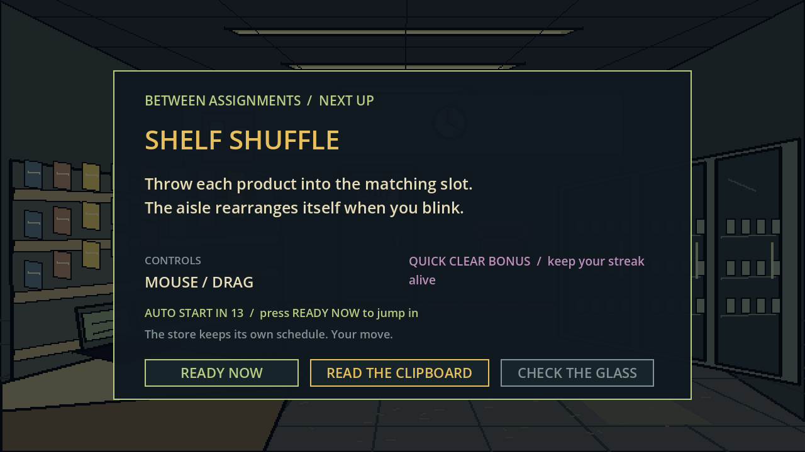
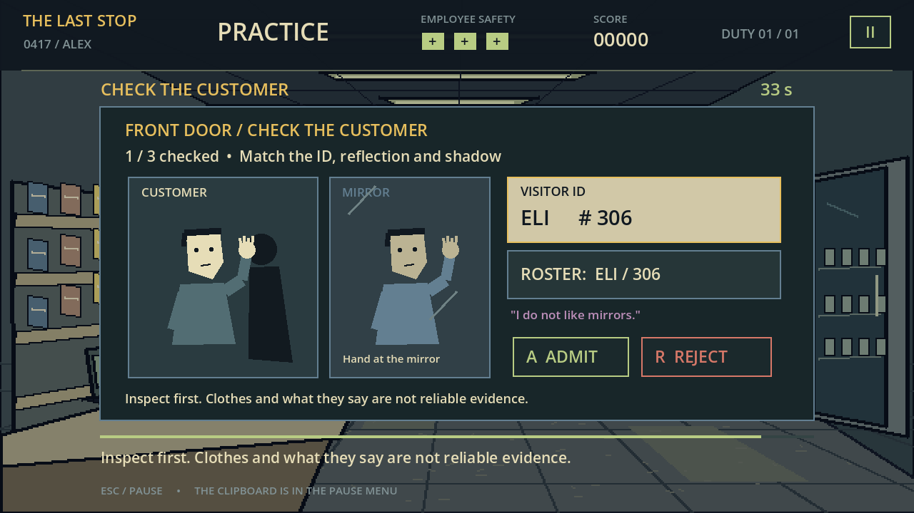

# CLOCK OUT ALIVE: THE GRAVEYARD SHIFT

*Your shift ends at 6 AM. The store does not.*

An original Godot 4 lo-fi workplace-horror arcade game about the overnight senior employee at The Last Stop. Clear eighteen escalating challenges, chain streak bonuses, decide which instructions deserve your trust, and make it to the front door with at least one safety mark.

Play in the browser: [CLOCK OUT ALIVE on GitHub Pages](https://hustlenix.github.io/clock-out-alive/)

Download the [Windows build or editable Godot project](https://github.com/Hustlenix/clock-out-alive/releases/latest).

## Quick start

- Browser: open the link above and click **NEW SHIFT**.
- Windows: extract `ClockOutAlive-Windows.zip` and run `ClockOutAlive.exe`.
- Godot: extract `ClockOutAlive-Godot.zip`, import `project.godot` in Godot 4.7.1, then press **F5** to run the project.
- Command line: `Godot_v4.7.1-stable_win64_console.exe --path .`.

The browser export lives in `docs/index.html`. A Windows desktop export is written to `builds/windows/ClockOutAlive.exe` when the Windows preset is run.

## Features

- Ten input-driven arcade microgames, each with a success path, failure path, timer pressure, quick-clear scoring, feedback, and a guarded single completion signal.
- Eighteen-assignment shift: the first eight challenges return with harder variations, followed by the phone contradiction and final sign-out.
- Between assignments, a dedicated next-challenge card previews the objective, controls, quick-clear bonus, countdown, clipboard clue, and READY NOW jump-in without covering the play space with debug text.
- READY NOW starts gameplay immediately. Pause preserves the current screen and timer, and the clipboard retains every collected note for rereading.
- Three Employee Safety points. Failures alter the rest of the shift through darker ambience, silhouettes, harder variations, and altered store feedback.
- Eight previous-employee notes, progressive contradictions, optional Camera 4 evidence, and an inferable phone answer.
- Loading screen, manager briefing, pause/restart, settings, volume, reduced motion, local best score, practice stations, winner scene, death scene, credits, and replay.
- Compatibility renderer and responsive canvas for keyboard and mouse desktop browsers.

## Controls

Mouse dragging and clicking are used for the scanner, shelf shuffle, cameras, rat race, notes, and buttons. Keyboard challenges use WASD/arrows, number keys, A/R, Space, Tab, and text entry as shown on each challenge card. `Esc` pauses the shift.

The clock-out form requires the badge details `ALEX` and `0417`. The phone's answer is the sentence learned from the notes: **My shift ends at six.**

## Architecture

`Main` owns loading, schedule, HUD, clock, score, safety, notes, persistence, pause, endings, and replay. `ShiftMicrogame` is the reusable base for initialization, difficulty, timers, input, drawing, cleanup, and the exactly-once `completed` signal. Each task in `scripts/microgames/` owns only its interaction and local state. `ShiftStory` holds the progressive notes and phase labels; `ShiftAudio` owns cues, loops, volume, and escalation.

## Validation

Godot 4.7.1 headless checks currently pass:

- `tests/test_first_five.gd`: 342 assertions, 0 failures.
- `tests/test_microgames_six_ten.gd`: 261 assertions, 0 failures.
- `tests/test_shift.gd`: 158 assertions, 0 failures, including pause/settings round trips, retained notes, immediate start, audio reset, and both endings.
- `tests/test_ui_layout.gd`: 988 assertions, 0 failures across menus, ten briefing/intermission cards, notes, clipboard, pause, and endings; native OpenGL render captures were visually inspected.
- `tests/test_full_shift_inputs.gd`: 94 assertions, 0 failures through all eighteen assignments using real input handlers. Its frame-simulated play profile is 9:23 with notes and 7:54 on the fast replay path; the 1.53 second test runtime is not presented as play time.
- `source_art/validate_assets.py`: 30 RGBA art assets and 18 PCM WAV files validated.

## Assets and audio

The raster art is original code-authored Pillow work with preserved scene layers and generation source in `source_art/`; it is not described as Microsoft Paint or AI-generated finished art. The WAV cues are original synthesized mono files. See [ASSET_CREDITS.md](ASSET_CREDITS.md) for the exact disclosure and file inventory.

## Godot version and export

Built and exported with Godot 4.7.1 stable using the Compatibility renderer. `export_presets.cfg` defines Web output at `docs/index.html` and a Windows x86_64 build at `builds/windows/ClockOutAlive.exe`.

For a reproducible tested export, run `powershell -File tools/build.ps1 -Godot "C:\path\to\Godot_v4.7.1-stable_win64_console.exe"` with the matching Web and Windows export templates installed. To preview the web export locally, run `python -m http.server 8765 --directory docs`, then open `http://localhost:8765/`.

Godot and bundled third-party notices are included in [GODOT_NOTICES.txt](GODOT_NOTICES.txt) and the downloadable builds. GitHub Pages hosts the web preview; the Godot archive is the editable engine project.

## AI usage disclosure

Codex was used as a coding and production assistant. Game logic, authored raster-generation source, synthesized audio source, tests, documentation, and the final Godot project are included here. No proprietary assets or copyrighted music are bundled.

## Known limitations

This is a desktop-first browser game: touch controls and mobile portrait layouts are not targets. Audio quality is intentionally lo-fi and should be evaluated on the player's device. The project brief requested a minimum of six real development hours; active elapsed development was not tracked reliably in this run, so that time requirement is not claimed.
